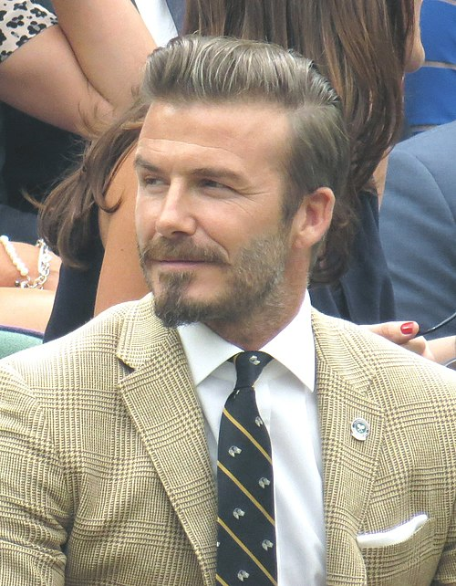

# Бурин Никита #

Спортивная карьера Бекхэма началась после подписания профессионального контракта с «Манчестер Юнайтед», в котором он дебютировал в 1992 году в возрасте 17 лет[14]. Бекхэм выиграл с «Манчестер Юнайтед» 6 чемпионских титулов Премьер-лиги, 2 Кубка Англии и Лигу чемпионов

1. Бегаю
2. Прыгаю
3. Ползаю

